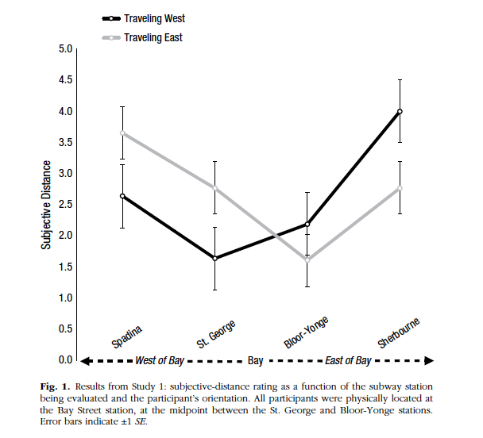

```{r}
articleID <- "6-7-2014_PS" # insert the article ID code here e.g., "10-3-2015_PS"
reportType <- 'final'
pilotNames <- "Dawn Finzi, Kiara Sanchez" # insert the pilot's name here e.g., "Tom Hardwicke". If there are multiple pilots enter both names in a character string e.g., "Tom Hardwicke, Bob Dylan"
copilotNames <- "Ben Peloquin" # insert the co-pilot's name here e.g., "Michael Frank". If there are multiple co-pilots enter both names in a character string e.g., "Tom Hardwicke, Bob Dylan"
pilotTTC <- 180 # insert the pilot's estimated time to complete (in minutes, fine to approximate) e.g., 120
copilotTTC <- 160 # insert the co- pilot's estimated time to complete (in minutes, fine to approximate) e.g., 120
pilotStartDate <- as.Date("11/02/17", format = "%m/%d/%y") # insert the pilot's start date in US format e.g., as.Date("01/25/18", format = "%m/%d/%y")
copilotStartDate <- as.Date("06/13/2018", format = "%m/%d/%y") # insert the co-pilot's start date in US format e.g., as.Date("01/25/18", format = "%m/%d/%y")
completionDate <- as.Date("06/20/2018", format = "%m/%d/%y") # copilot insert the date of final report completion (after any necessary rounds of author assistance) in US format e.g., as.Date("01/25/18", format = "%m/%d/%y")
```

-------

#### Methods summary: 

Researchers recruited 202 volunteers at a subway station in Toronto, Ontario, Canada. Half of the sample was traveling East, while the other half was traveling West. In a 2 (orientation: toward, away from) X 4 (station: Spadina, St. George, Bloor-Yonge, Sherbourne) design, each participant was randomly asked to estimate how far one of the four stations felt to them (1= very close, 7= very far). Authors conducted a 2 X 4 ANOVA on distance estimates, and then tested differences in distance estimates between East and West-bound groups for each individual station.

------

#### Target outcomes: 
> We carried out a 2 (orientation: toward, away from) × 4
(station: Spadina, St. George, Bloor-Yonge, Sherbourne)
analysis of variance (ANOVA) on closeness ratings, which
revealed no main effect of orientation, F < 1, and a main
effect of station, F(3, 194) = 24.10, p < .001, ηp
2 = .27. This main effect was qualified by the predicted interaction
between orientation and station, F(3, 194) = 16.28, p < .001, ηp2 = .20. We decomposed this interaction by the subjective-distance ratings between participants traveling
east and west for each of the four subway stations.
Westbound participants rated the stations to the west of
Bay Street as closer than did eastbound participants; this
effect was obtained for both the station one stop to the
west (St. George, p < .001, ηp2 = .28) and the station two
stops to the west (Spadina, p = .001, ηp2 = .20). The opposite
pattern held true for stations to the east of Bay Street.
Eastbound participants rated the stations to the east of
Bay Street as closer than did westbound participants; this
effect was obtained for both the station one stop to the
east (Bloor-Yonge, p = .053, ηp2 = .08) and the station two
stops to the east (Sherbourne, p < .001, ηp2 = .24). Figure 1 summarizes these results.

------

```{r global_options, include=FALSE}
knitr::opts_chunk$set(echo=TRUE, warning=FALSE, message=FALSE)
options(stringsAsFactors = FALSE)
```

# Step 1: Load packages

```{r}
library(tidyverse) # for data munging
library(knitr) # for kable table formating
library(haven) # import and export 'SPSS', 'Stata' and 'SAS' Files
library(readxl) # import excel files
library(ReproReports) # custom report functions
library(lsr)
library(ggthemes)
```

```{r}
# Prepare report object. This will be updated automatically by the reproCheck function each time values are compared.
reportObject <- data.frame(dummyRow = TRUE, 
                           reportedValue = NA, 
                           obtainedValue = NA, 
                           valueType = NA, 
                           percentageError = NA, 
                           comparisonOutcome = NA, eyeballCheck = NA)
```

# Step 2: Load data

```{r}
d <- read_excel ("data/S1_Subway.xlsx")
```

# Step 3: Tidy data

Data already in tidy format.

# Step 4: Run analysis

## Pre-processing

```{r}
# make variables factors
d$DIRECTION <- as.factor(d$DIRECTION)
d$STN_NAME<- as.factor(d$STN_NAME)

# subset dataframes for individual tests 
BY <- subset(d, STN_NAME == "B-Y")
SHER <- subset(d, STN_NAME == "SHER")
SPAD <-subset(d, STN_NAME == "SPAD")
STG<- subset(d, STN_NAME == "STG")
```

```{r save-old-code, eval=FALSE, echo=FALSE}
# Save below
#Tried different contrasts to get reported main effect. No success. Same output with different contrasts.

# set levels
#d$STN_NAME = factor(d$STN_NAME,levels = c('SPAD', 'STG', 'B-Y', 'SHER'))

#backward difference coding
#contrasts(d$STN_NAME) = cbind(C1=c(-.75, .25, .25, .25), 
                           #C2=c(-.5, -.5, .5, .5),
                           #C3=c(-.25, -.25, -.25, .75)); contrasts(d$STN_NAME)

#other coding schemes
#contrasts(d$STN_NAME) = cbind(C1=c(-1, 1, 0, 0), 
                           #C2=c(0, 1, -1, 0),
                           #C3=c(-0, 0, 1, -1)); contrasts(d$STN_NAME)
```


## Descriptive statistics

```{r descriptive-stats, message=FALSE, eval=FALSE, echo=FALSE}
# Ns for each condition 
# West should = 101 ; East should = 101
N_cond <- d %>%
  group_by(DIRECTION) %>%
  summarise(N = length(DIRECTION))

kable(N_cond, caption="Sample sizes") #Ns are correct

summary_STN <- d %>%
  group_by(STN_NAME) %>%
  summarise(mean_distance = mean(DISTANCE), 
            sd_distance = sd(DISTANCE))
kable(summary_STN, caption="Distance by station")

summary_DIRECTION <- d %>%
  group_by(DIRECTION) %>%
  summarise(mean_distance = mean(DISTANCE), 
            sd_distance = sd(DISTANCE))
kable(summary_DIRECTION, caption="Distance by direction") 

summary_int <- d %>%
  group_by(STN_NAME, DIRECTION) %>%
  summarise(mean_distance = mean(DISTANCE), 
            sd_distance = sd(DISTANCE))
kable(summary_int, caption="Interaction summary") #interaction summary
```

Reproducing fig1:

```{r reproduce-fig1}
d %>%
  mutate(STN_NAME=factor(STN_NAME, levels=c("SPAD", "STG", "B-Y", "SHER"))) %>%
  group_by(STN_NAME, DIRECTION) %>%
  summarise(mean_distance=mean(DISTANCE), 
            sd_distance=sd(DISTANCE),
            n=n(),
            y_min=mean_distance-qnorm(0.975)*sd_distance/sqrt(n),
            y_max=mean_distance+qnorm(0.975)*sd_distance/sqrt(n)) %>%
  ggplot(aes(x=STN_NAME, y=mean_distance, col=DIRECTION)) +
    geom_point() +
    geom_errorbar(aes(ymin=y_min, ymax=y_max), width=0.05) +
    geom_path(aes(group=DIRECTION)) +
    ylab("Subjective Distance") +
    xlab("Station") +
    ylim(0, 5) +
    theme_classic() +
    ggtitle("Reproducing Fig1") +
    theme(plot.title = element_text(hjust = 0.5)) 
```

```{r fig1-manual-entry}
# Eyeball checks from reproduced fig1
spadinaWest <- 2.6
spadinaEast <- 3.5
stgeorgeWest <- 1.8
stgeorgeEast <- 2.9
byWest <- 2
byEast <- 1.7
sherWest <- 4
sherEast <- 2.5
```



```{r fig1-repro-check}
# spadina west
reportObject <- reproCheck(reportedValue="figure", 
                           obtainedValue=spadinaWest, 
                           valueType = 'mean', 
                           eyeballCheck=TRUE)
# spadina east
reportObject <- reproCheck(reportedValue="figure", 
                           obtainedValue=spadinaEast, 
                           valueType = 'mean', 
                           eyeballCheck=TRUE)
# st george west
reportObject <- reproCheck(reportedValue="figure", 
                           obtainedValue=stgeorgeWest, 
                           valueType = 'mean', 
                           eyeballCheck=TRUE)
# st george east
reportObject <- reproCheck(reportedValue="figure", 
                           obtainedValue=stgeorgeEast, 
                           valueType = 'mean', 
                           eyeballCheck=TRUE)
# bloor-yonge west
reportObject <- reproCheck(reportedValue="figure", 
                           obtainedValue=byWest, 
                           valueType = 'mean', 
                           eyeballCheck=TRUE)
# bloor-yonge east
reportObject <- reproCheck(reportedValue="figure", 
                           obtainedValue=byEast, 
                           valueType = 'mean', 
                           eyeballCheck=TRUE)

# sherbourne west
reportObject <- reproCheck(reportedValue="figure", 
                           obtainedValue=sherWest, 
                           valueType = 'mean', 
                           eyeballCheck=TRUE)
# sherbourne east
reportObject <- reproCheck(reportedValue="figure", 
                           obtainedValue=sherEast, 
                           valueType = 'mean', 
                           eyeballCheck=TRUE)


```


# Inferential statistics

```{r test1}
# 2 (DIRECTION) X 4 (STATION) ANOVA
t1 <- aov(DISTANCE ~ DIRECTION * STN_NAME, data=d)
t1_summary <- summary(t1)
t1_summary
```

```{r test1-repro-check-Fs}
# Test main effect of orientation
reportObject <- reproCheck(reportedValue="<1", 
                           obtainedValue=t1_summary[[1]]$`F value`[1], 
                           valueType = 'F', 
                           eyeballCheck=TRUE)
# Test main effect of station
reportObject <- reproCheck(reportedValue="24.10", 
                           obtainedValue=t1_summary[[1]]$`F value`[2], 
                           valueType = 'F')
# Test interaction between orientation and station
reportObject <- reproCheck(reportedValue="16.28", 
                           obtainedValue=t1_summary[[1]]$`F value`[3], 
                           valueType='F')
```


```{r test-2-eta-sq}
eta2 <- etaSquared(t1)
kable(eta2, caption="Partial eta squared")
```

```{r test 2 repro check eta2s}
station_p_eta2 <- eta2[5]
interaction_p_eta2 <- eta2[6]
# Test main effect of station
reportObject <- reproCheck(reportedValue = "0.27", obtainedValue = station_p_eta2, valueType = 'other')  # eta squared
# Test interaction between orientation and station
reportObject <- reproCheck(reportedValue = "0.20", obtainedValue = interaction_p_eta2, valueType = 'other')  # eta squared
```

### Station-specific analyses

```{r echo=FALSE, data-hold}
# DISTANCE ~ DIRECTION for each station
df_stations <- data.frame()
```

#### St. George
```{r st-george}
#St. George
t2 <- aov(DISTANCE ~ DIRECTION, data=STG)
t2_summary <- summary(t2); t2_summary
etaSQ_t2 <- etaSquared(t2); etaSQ_t2
```

```{r st-george-cache, echo=FALSE}
df_stations <- rbind(df_stations, 
                     data.frame("reportedValue"="<0.001",
                                "obtainedValue"=t2_summary[[1]]$`Pr(>F)`[1], 
                                "valueType"="p", 
                                "station"="st george",
                                "eyeballCheck"=TRUE))
df_stations <- rbind(df_stations, 
                     data.frame("reportedValue"="0.28", 
                                "obtainedValue"=0.28, 
                                "valueType"="other", 
                                "station"="st george",
                                "eyeballCheck"=NA))
```

#### Spadina
```{r spadina}
#Spadina
t3 <- aov(DISTANCE ~ DIRECTION, data=SPAD)
t3_summary <- summary(t3); t3_summary
etaSQ_t3 = etaSquared(t3); etaSQ_t3 
```

```{r spadina-cache, echo=FALSE}
df_stations <- rbind(df_stations, 
                     data.frame("reportedValue"="0.001", 
                                "obtainedValue"=t3_summary[[1]]$`Pr(>F)`[1],
                                "valueType"="p", 
                                "station"="spadina",
                                "eyeballCheck"=NA))
df_stations <- rbind(df_stations, 
                     data.frame("reportedValue"="0.20", 
                                "obtainedValue"=etaSQ_t3[2], 
                                "valueType"="other", 
                                "station"="spadina",
                                "eyeballCheck"=NA))
```

#### Bloor-Yonge
```{r bloor-yonge}
#Bloor-Yonge
t4 <- aov(DISTANCE ~ DIRECTION, data=BY)
t4_summary <- summary(t4); t4_summary
etaSQ_t4 = etaSquared(t4); etaSQ_t4
```

```{r bloor-yonge-cache, echo=FALSE}
df_stations <- rbind(df_stations, 
                     data.frame("reportedValue"="0.053", 
                                "obtainedValue"=t4_summary[[1]]$`Pr(>F)`[1],
                                "valueType"="p", 
                                "station"="bloor-yonge",
                                "eyeballCheck"=NA))
df_stations <- rbind(df_stations, 
                     data.frame("reportedValue"="0.08", 
                                "obtainedValue"=etaSQ_t4[2], 
                                "valueType"="other",
                                "station"="bloor-yonge",
                                "eyeballCheck"=NA))
```

#### Sherbourne
```{r sherbourne}
#Sherbourne
t5 <- aov(DISTANCE ~ DIRECTION, data=SHER)
t5_summary <- summary(t5); t5_summary
etaSQ_t5 = etaSquared(t5); etaSQ_t5 
```

```{r sherbourne-cache, echo=FALSE}
df_stations <- rbind(df_stations, 
                     data.frame("reportedValue"="<0.001", 
                                "obtainedValue"=t5_summary[[1]]$`Pr(>F)`[1],
                                "valueType"="p", 
                                "station"="sherbourne",
                                "eyeballCheck"=TRUE))
df_stations <- rbind(df_stations, 
                     data.frame("reportedValue"="0.24", 
                                "obtainedValue"=etaSQ_t5[2], 
                                "valueType"="other",
                                "station"="sherbourne",
                                "eyeballCheck"=NA))
```

### Run station reproChecks
```{r get-data, echo=FALSE}
for (row in 1:nrow(df_stations)) {
  if (!is.na(df_stations[row, "eyeballCheck"])) {
    reportObject <- reproCheck(df_stations[row, "reportedValue"], 
                             df_stations[row, "obtainedValue"],
                             df_stations[row, "valueType"],
                             df_stations[row, "eyeballCheck"],)
    
  } else {
    reportObject <- reproCheck(df_stations[row, "reportedValue"], 
                             df_stations[row, "obtainedValue"],
                             df_stations[row, "valueType"])
  }
}
```

# Step 5: Conclusion

We were able to successfully reproduce all target outcomes.

```{r}
Author_Assistance = FALSE # was author assistance provided? (if so, enter TRUE)

Insufficient_Information_Errors <- 0 # how many discrete insufficient information issues did you encounter?

# Assess the causal locus (discrete reproducibility issues) of any reproducibility errors. Note that there doesn't necessarily have to be a one-to-one correspondance between discrete reproducibility issues and reproducibility errors. For example, it could be that the original article neglects to mention that a Greenhouse-Geisser correct was applied to ANOVA outcomes. This might result in multiple reproducibility errors, but there is a single causal locus (discrete reproducibility issue).

locus_typo <- NA # how many discrete issues did you encounter that related to typographical errors?
locus_specification <- NA # how many discrete issues did you encounter that related to incomplete, incorrect, or unclear specification of the original analyses?
locus_analysis <- NA # how many discrete issues did you encounter that related to errors in the authors' original analyses?
locus_data <- NA # how many discrete issues did you encounter that related to errors in the data files shared by the authors?
locus_unidentified <- NA # how many discrete issues were there for which you could not identify the cause

# How many of the above issues were resolved through author assistance?
locus_typo_resolved <- NA # how many discrete issues did you encounter that related to typographical errors?
locus_specification_resolved <- NA # how many discrete issues did you encounter that related to incomplete, incorrect, or unclear specification of the original analyses?
locus_analysis_resolved <- NA # how many discrete issues did you encounter that related to errors in the authors' original analyses?
locus_data_resolved <- NA # how many discrete issues did you encounter that related to errors in the data files shared by the authors?
locus_unidentified_resolved <- NA # how many discrete issues were there for which you could not identify the cause

Affects_Conclusion <- FALSE # Do any reproducibility issues encounter appear to affect the conclusions made in the original article? This is a subjective judgement, but you should taking into account multiple factors, such as the presence/absence of decision errors, the number of target outcomes that could not be reproduced, the type of outcomes that could or could not be reproduced, the difference in magnitude of effect sizes, and the predictions of the specific hypothesis under scrutiny.
```

```{r}
reportObject <- reportObject %>%
  filter(dummyRow == FALSE) %>% # remove the dummy row
  select(-dummyRow) %>% # remove dummy row designation
  mutate(articleID = articleID) %>% # add the articleID 
  select(articleID, everything()) # make articleID first column

# decide on final outcome
if(any(reportObject$comparisonOutcome %in% c("MAJOR_ERROR", "DECISION_ERROR")) | Insufficient_Information_Errors > 0){
  finalOutcome <- "Failure without author assistance"
  if(Author_Assistance == T){
    finalOutcome <- "Failure despite author assistance"
  }
}else{
  finalOutcome <- "Success without author assistance"
  if(Author_Assistance == T){
    finalOutcome <- "Success with author assistance"
  }
}

# collate report extra details
reportExtras <- data.frame(articleID, pilotNames, copilotNames, pilotTTC, copilotTTC, pilotStartDate, copilotStartDate, completionDate, Author_Assistance, finalOutcome, Insufficient_Information_Errors, locus_typo, locus_specification, locus_analysis, locus_data, locus_unidentified, locus_typo_resolved, locus_specification_resolved, locus_analysis_resolved, locus_data_resolved, locus_unidentified_resolved)

# save report objects
if(reportType == "pilot"){
  write_csv(reportObject, "pilotReportDetailed.csv")
  write_csv(reportExtras, "pilotReportExtras.csv")
}

if(reportType == "final"){
  write_csv(reportObject, "finalReportDetailed.csv")
  write_csv(reportExtras, "finalReportExtras.csv")
}
```

# Session information

```{r session_info, include=TRUE, echo=TRUE, results='markup'}
devtools::session_info()
```
